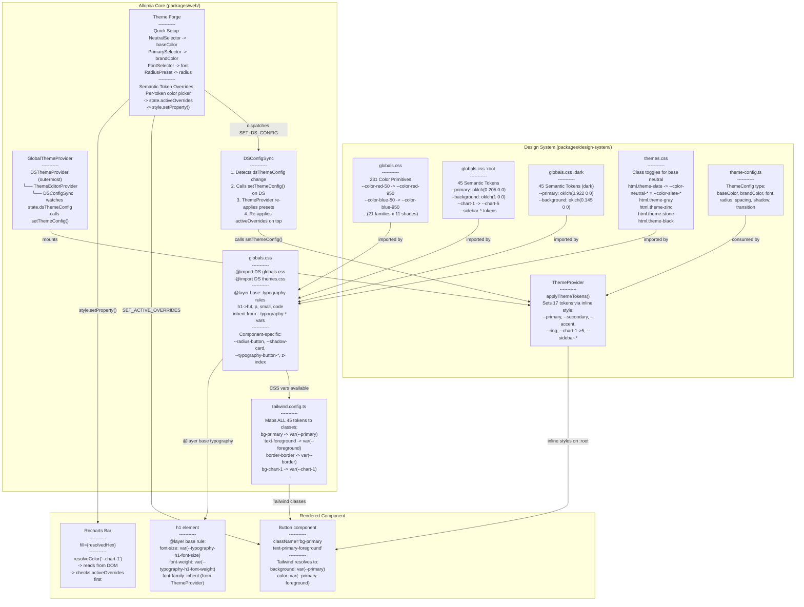
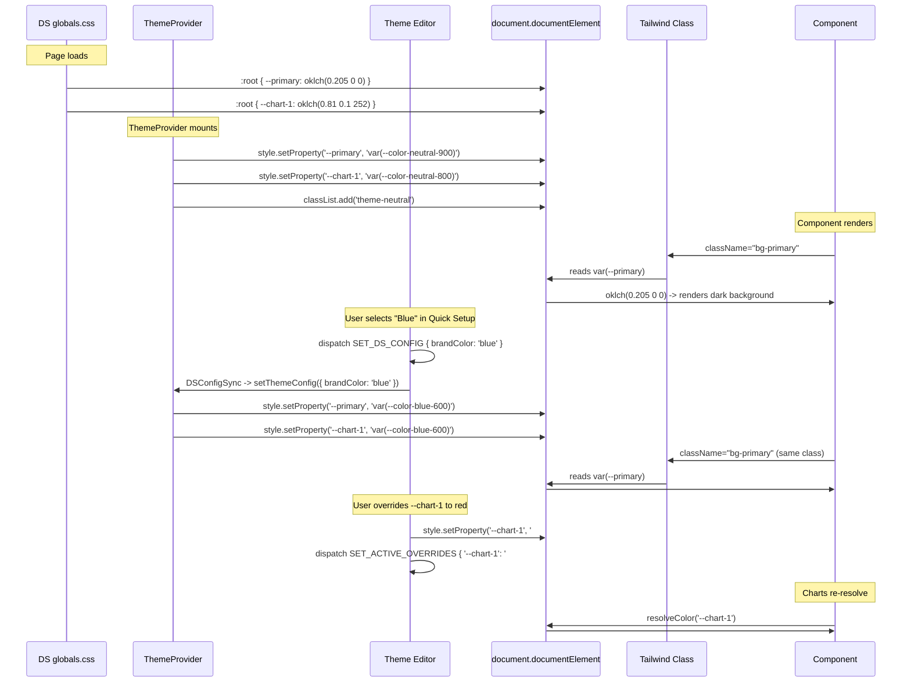
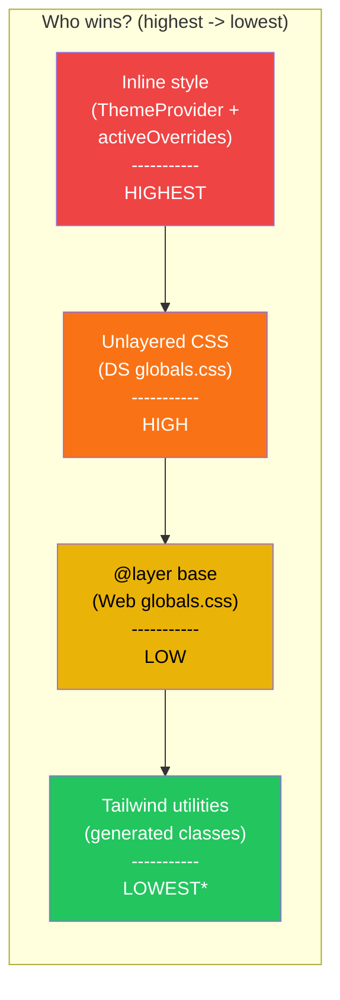
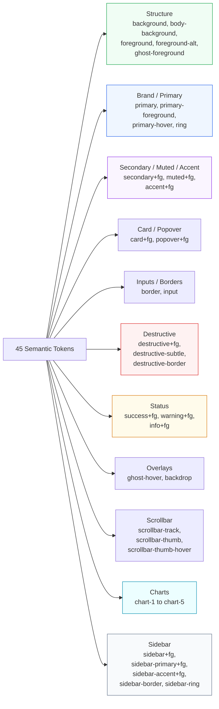
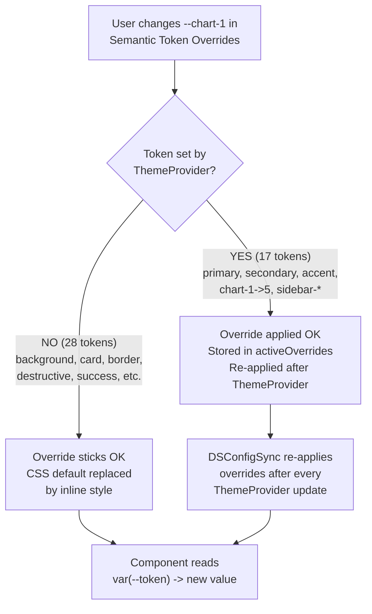

# Color System Architecture

> **Live Reference:** [http://localhost:3000/es/color-system](http://localhost:3000/es/color-system)

How a color flows from the Design System to a rendered component in Alkimia Core.

## Complete Flow



## Token Lifecycle



## CSS Specificity Chain



> *Tailwind utilities read from CSS variables, so they automatically reflect whichever value wins above.

## Token Categories



## Override Behavior



## File Map

```
Design System (source of truth)
├── web/app/globals.css          ← 231 primitives + 45 semantic tokens + typography
├── web/app/themes.css           ← neutral scale class toggles (6 options)
├── web/components/theme-provider.tsx  ← applies 17 tokens via JS inline styles
└── web/lib/theme-config.ts      ← ThemeConfig type + constants

Alkimia Core (consumer)
├── src/app/[lang]/globals.css   ← imports DS + component-specific tokens
├── tailwind.config.ts           ← maps ALL 45 tokens to Tailwind classes
├── src/context/GlobalThemeProvider.tsx  ← DSConfigSync bridge
└── src/components/features/theme-forge/
    ├── core/context/             ← state: dsThemeConfig + activeOverrides
    ├── theme-editor/editor/colors/
    │   ├── ds-preset-selectors.tsx  ← Quick Setup (presets)
    │   └── semantic-token-overrides.tsx  ← Per-token overrides
    └── preview/tabs/elements/    ← Elements preview (reads resolved colors)
```

## Brechas conocidas en la cadena de tokens

> Las métricas globales de "completitud" se retiraron porque mezclaban capas (cobertura de Theme Forge, cobertura de Tailwind, cobertura de la cascada CSS) y daban una falsa sensación de integridad. Lo que sí es accionable es el listado concreto de tokens que la app emite vs. los que quedan congelados en CSS estático.

- **Spacing:** `ThemeProvider` solo setea `--spacing-lg`. El resto de la escala (`--spacing-xs` … `--spacing-3xl`) existe en CSS pero no responde al `SpacingPresetSelector`. Muchos componentes consumen clases Tailwind con valores fijos (`p-4`, `gap-3`).
- **Shadows:** se emiten `--shadow-card` y `--shadow-card-hover`. Sombras de botón, diálogo y tooltip (`--shadow-button`, `--shadow-dialog`, `--shadow-tooltip`) viven como valores estáticos.
- **Border-radius:** la app emite un subconjunto reducido de variables `--radius-*`. El resto de los radios queda servido por fallbacks en `globals.css`. Tracking detallado: ver `.problems-to-solve-design-system.md`.
- **Tipografía:** existen dos definiciones distintas de `ThemeTypography` en el código (`packages/web/src/types/typography.ts` vs. `packages/web/src/components/features/theme-forge/core/types/theme.types.ts`). Tracking en `.problems-to-solve-design-system.md`.
- **Tokens huérfanos:** `--info` y `--info-foreground` se definen en `globals.css` para `:root` y `.dark`, pero no aparecen en `ThemeColors` ni en `CSS_VARIABLE_MAP`, por lo que Theme Forge no puede editarlos. Tracking en `.problems-to-solve-design-system.md`.

## Advanced Overrides (Future: Per-Component)

The current Semantic Token Overrides system allows changing global CSS variables
(`--primary`, `--chart-1`, etc.) that affect ALL components using that token.

The next level is **per-component overrides** — changing a property for ONE specific
component without affecting others. This would work by ID or component class.

### How it would work

```
Global Override (current):
  --radius: 0.5rem         -> ALL rounded-lg components get 0.5rem

Per-Component Override (future):
  #login-button { --radius: 9999px }    -> only login button gets full round
  .card-stats  { --shadow-card: none }  -> only stat cards lose shadow
  #hero-title  { --typography-h1-font-size: 64px } -> only hero h1 gets bigger
```

### Target components for per-ID overrides

| Component | CSS Variable | What it controls |
|-----------|-------------|-----------------|
| Button | `--radius-button` | Corner radius for all buttons |
| Card | `--radius-card`, `--shadow-card` | Corner radius + shadow depth |
| Dialog | `--radius-dialog`, `--shadow-dialog` | Modal corners + shadow |
| Input | `--radius-input` | Input field corners |
| Badge | `--radius-badge` | Badge pill shape |
| Avatar | `--radius-avatar` | Avatar circle/square |
| Tooltip | `--radius-tooltip`, `--shadow-tooltip` | Tooltip corners + shadow |
| Toast | `--radius-toast` | Toast notification corners |
| Tabs | `--radius-tabs` | Tab button corners |
| Select | `--radius-select` | Select dropdown corners |

### Implementation approach

These component-specific CSS variables already exist in `globals.css`:
```css
--radius-button: var(--radius);
--radius-card: calc(var(--radius) + 4px);
--radius-dialog: calc(var(--radius) + 8px);
--shadow-card: var(--shadow-md);
--shadow-dialog: var(--shadow-2xl);
```

They derive from the global `--radius` and `--shadow-*` presets.
A per-component override would use `style.setProperty()` scoped to
a specific element ID or class, overriding only that component's variable.

This does NOT require changes to the DS ThemeProvider. It's an alkimia-core
Theme Editor feature that adds inline styles to specific DOM elements.
