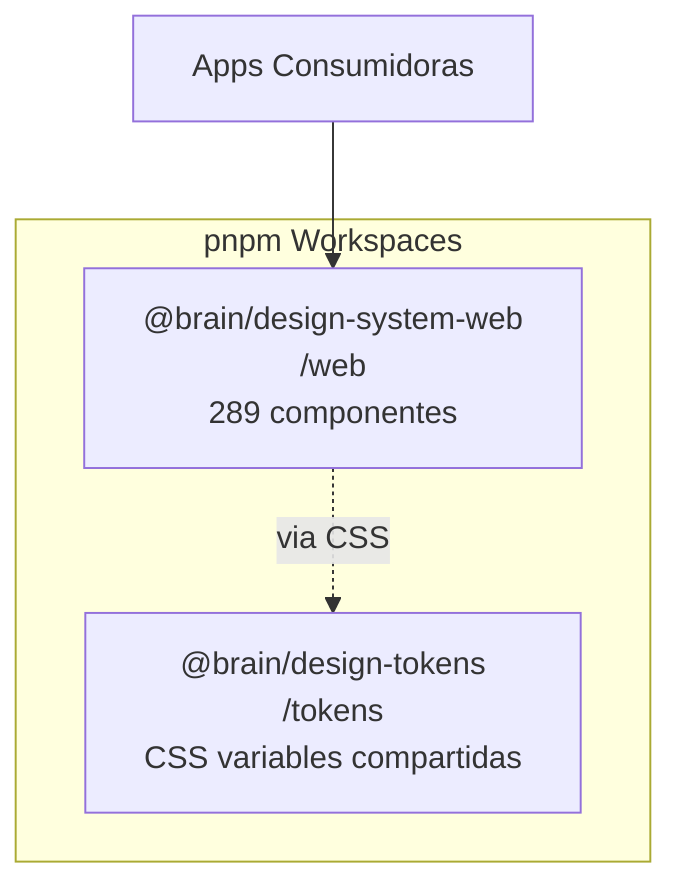
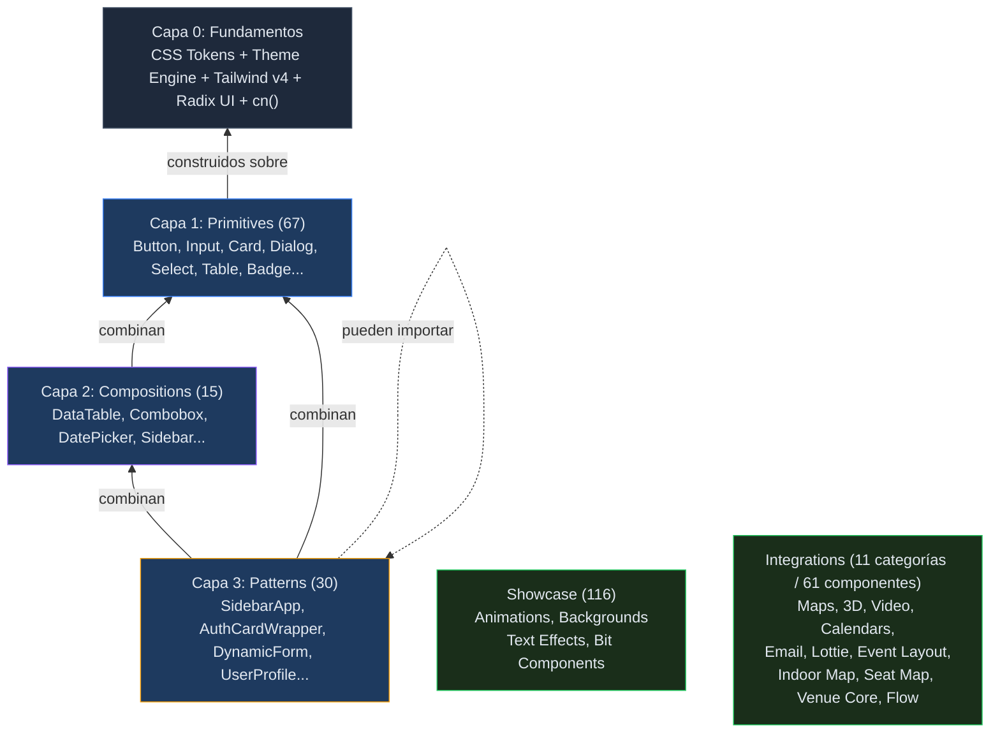
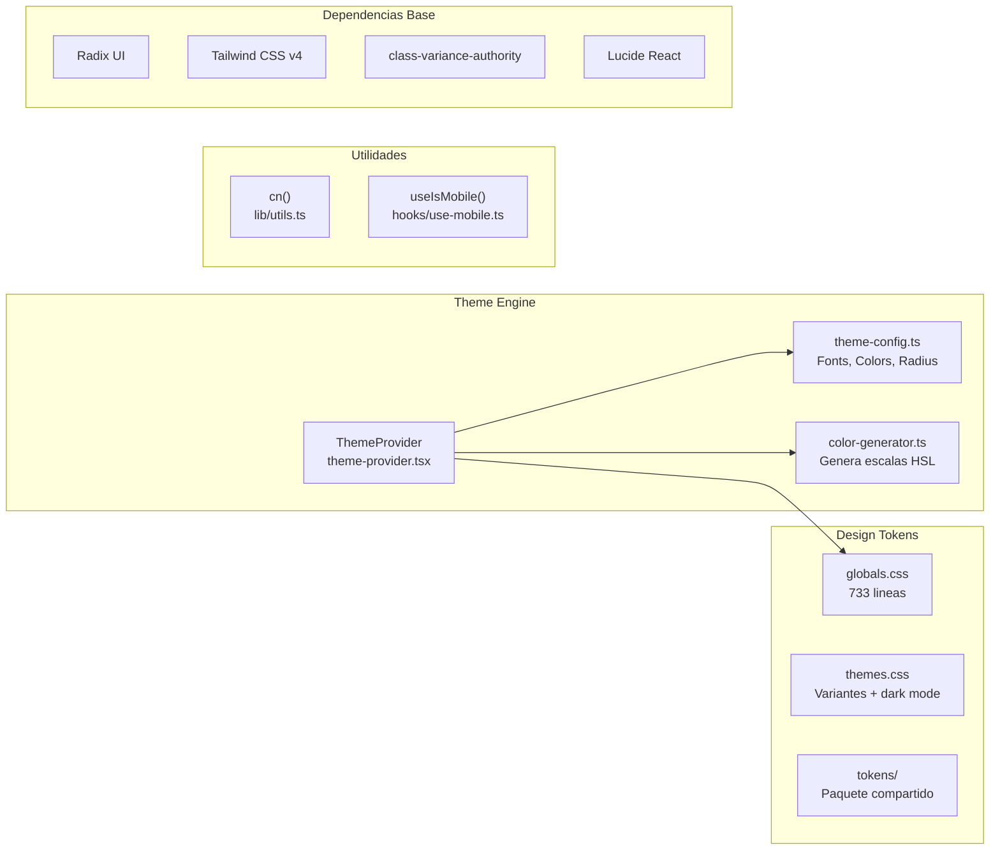
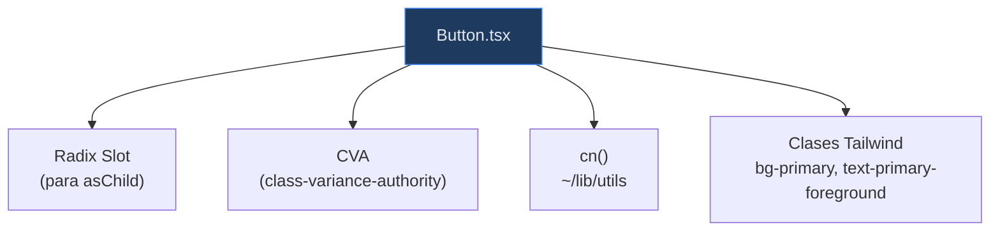
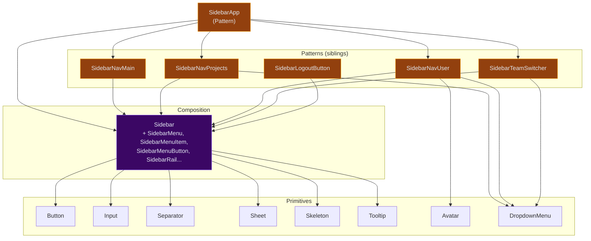
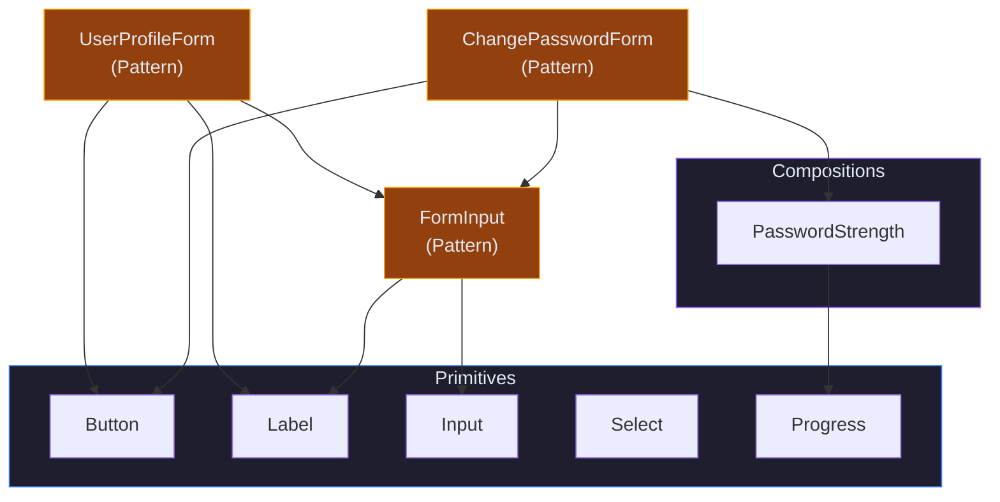
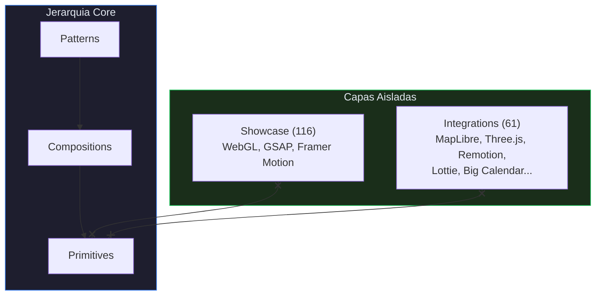
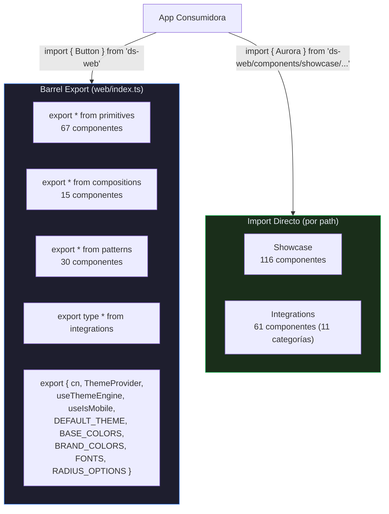
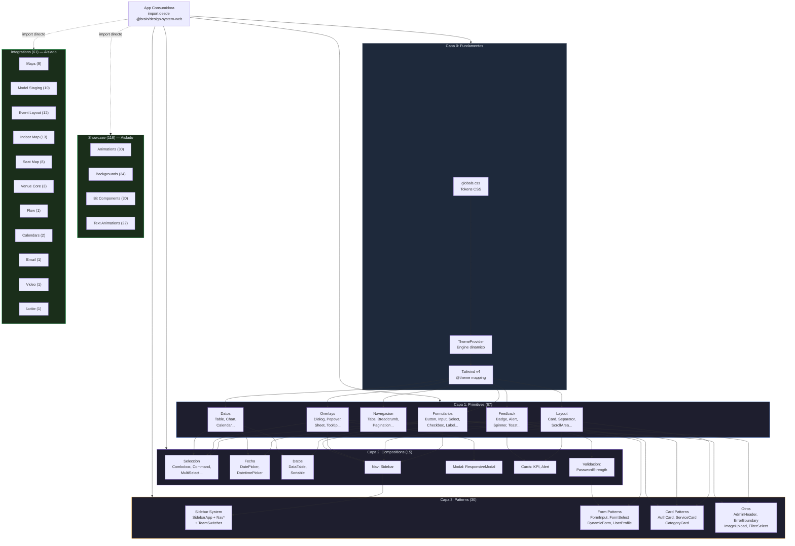

# Arquitectura del Design System

> **Verificación de conteo de componentes:** 2026-04-29 01:39 CEST — todas las cifras de este documento se contrastaron contra el código fuente en `packages/design-system/web/components/`.

## 1. Vision General

**Nombre:** `@brain/design-system` (v0.1.0)
**Tipo:** Monorepo con pnpm workspaces
**Stack:** Next.js 16.1.6 + React 19 + TypeScript 5 + Tailwind CSS v4 + Storybook 10.2.9



| Paquete | Path | Rol | Dependencias internas |
|---------|------|-----|----------------------|
| `@brain/design-tokens` | `/tokens` | Tokens CSS primitivos | Ninguna (base) |
| `@brain/design-system-web` | `/web` | Componentes web + theming | tokens (via CSS) |

> **Nota sobre `packages/design-system/mobile/`:** existe como cascarón (solo `package.json` e `index.ts` con todos los exports comentados). Su destino — eliminarlo o re-encuadrarlo — está abierto y se trata como un problema a resolver separado. Ver `.problems-to-solve-design-system.md`.

---

## 2. Jerarquia de Capas



> **Regla fundamental:** las dependencias solo fluyen hacia abajo. Primitives nunca importan de Compositions, y Compositions nunca importan de Patterns. Showcase e Integrations son islas independientes.

---

## 3. Capa 0: Fundamentos

Todo componente del sistema depende de esta capa base.



### Archivos clave

| Archivo | Path | Contenido |
|---------|------|-----------|
| Global Tokens | `/web/app/globals.css` | 733 lineas: colores semanticos, escalas 50-950, radios, sombras, animaciones |
| Temas | `/web/app/themes.css` | Variantes por color base (neutral, slate, gray, zinc, stone) + dark mode |
| Token Package | `/tokens/index.css` | Entry point de tokens compartidos (consumido vía CSS por `web`) |
| Theme Provider | `/web/components/theme-provider.tsx` | ThemeProvider + useThemeEngine() hook |
| Theme Config | `/web/lib/theme-config.ts` | 14 fonts, 19 brand colors, 5 base colors, 9 radius options |
| Color Generator | `/web/lib/color-generator.ts` | Genera escala completa 50-950 desde un HEX |
| Utilities | `/web/lib/utils.ts` | cn() = clsx + tailwind-merge |
| Mobile Hook | `/web/hooks/use-mobile.ts` | useIsMobile() breakpoint 768px |

### Flujo de Tokens


### Tokens disponibles

- **Colores semanticos:** primary, secondary, destructive, muted, accent, background, foreground, card, popover, border, input, ring
- **Escalas de color:** 11 tonos (50-950) para 20+ paletas (neutral, slate, gray, zinc, stone, red, orange, amber, yellow, lime, green, emerald, teal, cyan, sky, blue, indigo, violet, purple, fuchsia, pink, rose)
- **Border radius:** 9 niveles (xs, sm, md, lg, xl, 2xl, 3xl, full)
- **Shadows:** 8 niveles (2xs, xs, sm, md, lg, xl, 2xl)
- **Animaciones:** fade-in, fade-out, slide-in, slide-out, spin
- **Scrollbar:** track, thumb, thumb-hover
- **Chart colors:** tokens para visualizacion de datos

---

## 4. Capa 1: Primitives (67 componentes)

**Path:** `/web/components/primitives/`
**Rol:** Elementos UI indivisibles. No dependen de otros componentes internos.
**Export:** Barrel-exported via `primitives/index.ts` → `web/index.ts`

### Dependencia tipica de un primitive



### Organizacion por funcion

#### Formularios (16)

| Componente | Archivo | Base |
|------------|---------|------|
| Button | `button/button.tsx` | CVA variants: default, destructive, outline, secondary, ghost, link |
| Button Group | `button-group/button-group.tsx` | |
| Checkbox | `checkbox/checkbox.tsx` | Radix Checkbox |
| Field | `field/field.tsx` | |
| Form | `form/form.tsx` | React Hook Form integration |
| Form Error | `form-error/form-error.tsx` | |
| Form Success | `form-success/form-success.tsx` | |
| Input | `input/input.tsx` | |
| Input Group | `input-group/input-group.tsx` | |
| Input OTP | `input-otp/input-otp.tsx` | One-time password |
| Label | `label/label.tsx` | Radix Label |
| Password Input | `password-input/password-input.tsx` | |
| Radio Group | `radio-group/radio-group.tsx` | Radix RadioGroup |
| Select | `select/select.tsx` | Radix Select |
| Slider | `slider/slider.tsx` | Radix Slider |
| Textarea | `textarea/textarea.tsx` | |
| Autosize Textarea | `autosize-textarea/autosize-textarea.tsx` | |

#### Layout y Contenedores (8)

| Componente | Archivo | Base |
|------------|---------|------|
| Card | `card/card.tsx` | |
| Aspect Ratio | `aspect-ratio/aspect-ratio.tsx` | |
| Resizable | `resizable/resizable.tsx` | |
| Scroll Area | `scroll-area/scroll-area.tsx` | Radix ScrollArea |
| Separator | `separator/separator.tsx` | Radix Separator |
| Spacer | `spacer/spacer.tsx` | |
| Tailwind Grid | `tailwind-grid/tailwind-grid.tsx` | |
| Collapsible | `collapsible/collapsible.tsx` | Radix Collapsible |

#### Navegacion (5)

| Componente | Archivo | Base |
|------------|---------|------|
| Breadcrumb | `breadcrumb/breadcrumb.tsx` | |
| Navigation Menu | `navigation-menu/navigation-menu.tsx` | Radix NavigationMenu |
| Pagination | `pagination/pagination.tsx` | |
| Link Button | `link-button/link-button.tsx` | |
| Tabs | `tabs/tabs.tsx` | Radix Tabs |

#### Overlays y Modales (8)

| Componente | Archivo | Base |
|------------|---------|------|
| Dialog | `dialog/dialog.tsx` | Radix Dialog |
| Alert Dialog | `alert-dialog/alert-dialog.tsx` | Radix AlertDialog |
| Drawer | `drawer/drawer.tsx` | Vaul Drawer |
| Dropdown Menu | `dropdown-menu/dropdown-menu.tsx` | Radix DropdownMenu |
| Context Menu | `context-menu/context-menu.tsx` | Radix ContextMenu |
| Hover Card | `hover-card/hover-card.tsx` | Radix HoverCard |
| Popover | `popover/popover.tsx` | Radix Popover |
| Sheet | `sheet/sheet.tsx` | Radix Dialog-based |
| Tooltip | `tooltip/tooltip.tsx` | Radix Tooltip |

#### Feedback y Estado (8)

| Componente | Archivo | Base |
|------------|---------|------|
| Alert | `alert/alert.tsx` | |
| Badge | `badge/badge.tsx` | CVA variants |
| Chip | `chip/chip.tsx` | |
| Progress | `progress/progress.tsx` | Radix Progress |
| Skeleton | `skeleton/skeleton.tsx` | |
| Sonner (Toast) | `sonner/sonner.tsx` | Toast notifications |
| Spinner | `spinner/spinner.tsx` | |
| Status Badge | `status-badge/status-badge.tsx` | |

#### Datos y Visualizacion (5)

| Componente | Archivo | Base |
|------------|---------|------|
| Table | `table/table.tsx` | |
| Chart | `chart/chart.tsx` | Recharts wrapper |
| Calendar | `calendar/calendar.tsx` | react-day-picker |
| Carousel | `carousel/carousel.tsx` | embla-carousel |
| Infinite Scroll | `infinite-scroll/infinite-scroll.tsx` | |

#### Interaccion (7)

| Componente | Archivo | Base |
|------------|---------|------|
| Switch | `switch/switch.tsx` | Radix Switch |
| Toggle | `toggle/toggle.tsx` | Radix Toggle |
| Toggle Group | `toggle-group/toggle-group.tsx` | Radix ToggleGroup |
| Toggle Switch | `toggle-switch/toggle-switch.tsx` | |
| Interactive Stepper | `interactive-stepper/interactive-stepper.tsx` | |
| Theme Toggle | `theme-toggle/theme-toggle.tsx` | |
| Item | `item/item.tsx` | |

#### Contenido (6)

| Componente | Archivo | Base |
|------------|---------|------|
| Avatar | `avatar/avatar.tsx` | Radix Avatar |
| Empty | `empty/empty.tsx` | |
| Icon | `icon/icon.tsx` | |
| Custom Icon | `custom-icon/custom-icon.tsx` | |
| Typography | `typography/typography.tsx` | |
| Variable Chip | `variable-chip/variable-chip.tsx` | |

#### Otros (1)

| Componente | Archivo | Base |
|------------|---------|------|
| KBD | `kbd/kbd.tsx` | Keyboard shortcut display |

---

## 5. Capa 2: Compositions (15 componentes)

**Path:** `/web/components/compositions/`
**Rol:** Combinan 2+ primitives para crear funcionalidad compleja.
**Export:** Barrel-exported via `compositions/index.ts` → `web/index.ts`

### Dependencias de cada composition

```mermaid
graph TD
    subgraph Compositions
        CB["Combobox"]
        CMD["Command"]
        AMS["Advanced Multi-Select"]
        MS["Multiple Selector"]
        PS["Period Selector"]
        DP["Date Picker"]
        DTP["Datetime Picker"]
        DT["Data Table"]
        SORT["Sortable"]
        SB["Sidebar"]
        RM["Responsive Modal"]
        KPI["KPI Card"]
        AC["Alert Card"]
        PW["Password Strength"]
    end

    subgraph Primitives
        BTN["Button"]
        INP["Input"]
        BDG["Badge"]
        POP["Popover"]
        DLG["Dialog"]
        CAL["Calendar"]
        TBL["Table"]
        SEP["Separator"]
        SHT["Sheet"]
        SKL["Skeleton"]
        TTP["Tooltip"]
        SEL["Select"]
        CRD["Card"]
        TYP["Typography"]
        ALR["Alert"]
        PRG["Progress"]
    end

    subgraph External["Libs Externas"]
        TANK["@tanstack/react-table"]
        DND["@dnd-kit"]
        CMDK["cmdk"]
        DATEF["date-fns"]
        RADIX["Radix Dialog"]
    end

    CB --> BTN & BDG & POP & CMD
    CMD --> DLG & CMDK
    AMS --> POP & BDG & BTN & CMD
    MS --> BDG & CMD
    PS --> SEL & BTN
    DP --> BTN & CAL & POP & DATEF
    DTP --> BTN & CAL & POP & INP & DATEF
    DT --> BTN & INP & TBL & TANK
    SORT --> CRD & DND
    SB --> BTN & INP & SEP & SHT & SKL & TTP
    RM --> RADIX
    KPI --> CRD & TYP & BDG
    AC --> CRD & ALR
    PW --> PRG

    style Compositions fill:#1e1e2e,stroke:#8b5cf6,color:#e2e8f0
    style Primitives fill:#1e1e2e,stroke:#3b82f6,color:#e2e8f0
    style External fill:#1e1e2e,stroke:#475569,color:#e2e8f0
```



### Detalle por composition

| Composition | Usa Primitives | Usa Libs Externas |
|-------------|---------------|-------------------|
| Combobox | Button, Badge, Popover + Command (comp) | — |
| Command | Dialog | cmdk |
| Advanced Multi-Select | Popover, Badge, Button + Command (comp) | — |
| Multiple Selector | Badge + Command (comp) | — |
| Period Selector | Select, Button | — |
| Date Picker | Button, Calendar, Popover | date-fns |
| Datetime Picker | Button, Calendar, Popover, Input | date-fns |
| Data Table | Button, Input, Table* (6 sub-components) | @tanstack/react-table |
| Sortable | Card | @dnd-kit |
| Sidebar | Button, Input, Separator, Sheet, Skeleton, Tooltip (9+) | — |
| Responsive Modal | — | Radix Dialog directo |
| KPI Card | Card, Typography, Badge | — |
| Alert Card | Card, Alert | — |
| Password Strength | Progress | — |

---

## 6. Capa 3: Patterns (30 componentes)

**Path:** `/web/components/patterns/`
**Rol:** Combinan compositions + primitives + otros patterns para crear features completas.
**Export:** Barrel-exported via `patterns/index.ts` → `web/index.ts`

### Sistema de Sidebar (ejemplo de cadena completa)



### Formularios conectados (ejemplo de cadena)



### Todos los Patterns

#### Sistema de Sidebar (6)

| Pattern | Usa Compositions | Usa Primitives | Usa Patterns |
|---------|-----------------|----------------|--------------|
| sidebar-app | Sidebar | — | SidebarNavMain, SidebarNavProjects, SidebarNavUser |
| sidebar-nav-main | Sidebar sub-components | — | — |
| sidebar-nav-projects | Sidebar sub-components | DropdownMenu | — |
| sidebar-nav-user | Sidebar sub-components | Avatar, DropdownMenu | — |
| sidebar-team-switcher | Sidebar sub-components | DropdownMenu | — |
| sidebar-logout-button | Sidebar sub-components | — | — |

#### Formularios Conectados (8)

| Pattern | Usa Compositions | Usa Primitives | Usa Patterns |
|---------|-----------------|----------------|--------------|
| form-input | — | Input, Label | — |
| form-input-group | — | InputGroup, Label | — |
| form-select | — | Select, Label | — |
| form-textarea | — | Textarea, Label | — |
| checkbox-field | — | Checkbox, Label | — |
| dynamic-form | — | Input | — |
| user-profile-form | — | Button, Label | FormInput |
| user-preferences-form | — | Button, Select | FormInput |

#### Tarjetas Especializadas (6)

| Pattern | Usa Primitives |
|---------|---------------|
| auth-card-wrapper | Card, CardHeader, CardContent, CardFooter, Spinner, Typography |
| category-card | Card, Badge |
| service-card | Card, Button, Badge |
| connected-accounts-card | Card, Button, Switch |
| quick-action-card | Card, Icon |
| request-stats-link | Card, Typography |

#### Otros Patterns (11)

| Pattern | Dependencias principales |
|---------|------------------------|
| admin-page-header | Typography, Button |
| change-password-form | FormInput (pattern) + PasswordStrength (comp) + Button |
| email-visual-editor | Standalone |
| error-boundary | React ErrorBoundary |
| filter-select | Select, Popover |
| image-upload | Input, Button |
| preview-image | Dialog |
| selection-item | Checkbox |
| user-avatar | Avatar |
| user-pagination | Pagination, Button |

---

## 7. Capas Aisladas: Showcase e Integrations

Estas capas **no participan** en la jerarquia Primitive > Composition > Pattern. Son modulos independientes con sus propias dependencias externas.



### Showcase (116 componentes)

**Path:** `/web/components/showcase/`
**NO barrel-exported** — import directo por path para evitar bundle bloat.
**Autocontenidos** — usan WebGL, GSAP, Framer Motion, Canvas, GLSL. Sin deps internas.

> Conteo verificado 2026-04-29 01:39 CEST: animations 30 + backgrounds 34 + bit-components 30 + text-animations 22 = 116.

#### Animations (30) — `/web/components/showcase/animations/`

Efectos interactivos. Libs: GSAP, Framer Motion.

| | | | |
|---|---|---|---|
| Animated Content | Antigravity | Blob Cursor | Bubble Menu |
| Chroma Grid | Click Spark | Crosshair | Cubes |
| Electric Border | Fade Content | Ghost Cursor | Glare Hover |
| Gradual Blur | Image Trail | Laser Flow | Logo Loop |
| Magnet | Magnet Lines | Meta Balls | Metallic Paint |
| Noise | Orbit Images | Pixel Trail | Pixel Transition |
| Ribbons | Shape Blur | Splash Cursor | Star Border |
| Sticker Peel | Target Cursor | | |

#### Backgrounds (34) — `/web/components/showcase/backgrounds/`

Fondos animados. Libs: OGL (WebGL), Canvas API, GLSL shaders.

| | | | |
|---|---|---|---|
| Aurora | Balatro | Ballpit | Beams |
| Color Bends | Dark Veil | Dither | Faulty Terminal |
| Floating Lines | Galaxy | Gradient Blinds | Grainient |
| Grid Distortion | Grid Scan | Hyperspeed | Iridescence |
| Letter Glitch | Light Pillar | Light Rays | Lightning |
| Liquid Chrome | Liquid Ether | Orb | Particles |
| Pixel Blast | Pixel Snow | Plasma | Prism |
| Prismatic Burst | Ripple Grid | Silk | Squares |
| Threads | Waves | | |

#### Bit Components (30) — `/web/components/showcase/bit-components/`

Componentes UI premium. Libs: Framer Motion, GSAP, CSS 3D transforms.

| | | | |
|---|---|---|---|
| Animated List | Bounce Cards | Card Nav | Card Swap |
| Circular Gallery | Counter | Decay Card | Dock |
| Dome Gallery | Elastic Slider | Flowing Menu | Fluid Glass |
| Flying Posters | Folder | Glass Icons | Glass Surface |
| Gooey Nav | Infinite Menu | Lanyard | Magic Bento |
| Masonry | Pill Nav | Pixel Card | Profile Card |
| Reflective Card | Scroll Stack | Spotlight Card | Stack |
| Staggered Menu | Stepper | Tilted Card | |

#### Text Animations (22) — `/web/components/showcase/text-animations/`

Efectos tipograficos. Libs: GSAP, Framer Motion, Canvas.

| | | | |
|---|---|---|---|
| ASCII Text | Blur Text | Circular Text | Count Up |
| Curved Loop | Decrypted Text | Falling Text | Fuzzy Text |
| Glitch Text | Gradient Text | Rotating Text | Scrambled Text |
| Scroll Float | Scroll Reveal | Scroll Velocity | Shiny Text |
| Shuffle Text | Split Text | Text Cursor | Text Pressure |
| Text Type | True Focus | | |

### Integrations (11 categorías / 61 componentes)

**Path:** `/web/components/integrations/`
**Type-only exports** para tree-shaking. Import directo requerido.

> Conteo verificado 2026-04-29 01:39 CEST contando solo `.tsx` de implementación (excluyendo `*.stories.tsx`, `*.test.tsx` e `index.ts`).

| Categoría | Componentes (.tsx) | Stack base |
|-----------|-------------------:|------------|
| `maps/` | 9 | MapLibre GL JS |
| `model-staging/` | 10 | Three.js + React Three Fiber |
| `event-layout/` | 12 | (composición de mapas + seat-map) |
| `indoor-map/` | 13 | MapLibre + planos interiores |
| `seat-map/` | 8 | Layout de asientos (canvas/svg) |
| `venue-core/` | 3 | Modelo de venue compartido |
| `flow/` | 1 | Flujos de navegación (poc) |
| `calendars/` | 2 | react-big-calendar |
| `emails/` | 1 | React Email |
| `video/` | 1 | Remotion |
| `lottie/` | 1 | lottie-react |
| **Total** | **61** | — |

#### Maps — MapLibre GL JS

`maps/map/map.tsx`, `maps/map-wrapper.tsx`, `maps/map-cluster-layer.tsx`, `maps/map-controls-panel.tsx`, `maps/map-draggable-marker.tsx`, `maps/map-marker.tsx`, `maps/map-popup.tsx`, `maps/map-poster.tsx`, `maps/map-route.tsx`.

#### Model Staging / 3D — Three.js + React Three Fiber

`model-staging/model-viewer/model-viewer.tsx`, `model-staging/model-animations.tsx`, `model-staging/model-ar.tsx`, `model-staging/model-exporter.tsx`, `model-staging/model-hotspots.tsx`, `model-staging/model-post-process.tsx`, `model-staging/model-poster.tsx`, `model-staging/model-scroll-sync.tsx`, `model-staging/model-skybox.tsx`, `model-staging/model-variants.tsx`.

#### Event Layout / Indoor Map / Seat Map / Venue Core

Familia de integraciones para representación espacial (ej. recintos, butacas, planos interiores). Conteo agregado: 12 + 13 + 8 + 3 = 36 componentes. Cada subcarpeta contiene su propio entry y subcomponentes auxiliares.

#### Flow

`flow/`: 1 componente — exploración de flujos de navegación.

#### Calendars — react-big-calendar

`calendars/big-calendar.tsx`, `calendars/booking-calendar.tsx`.

#### Emails — React Email

`emails/email-preview.tsx`. Las plantillas (Welcome, Password Reset, Order Confirmation) viven como `*.stories.tsx` para Storybook y no cuentan como componentes de runtime.

#### Video — Remotion

`video/remotion-player/remotion-player.tsx`.

#### Lottie — lottie-react

`lottie/lottie-animation/lottie-animation.tsx`.

---

## 8. Sistema de Exports



### Subpath exports (package.json)

| Export path | Destino |
|-------------|---------|
| `.` | `index.ts` (barrel principal) |
| `./globals.css` | `app/globals.css` |
| `./themes.css` | `app/themes.css` |
| `./theme-provider` | `components/theme-provider.tsx` |
| `./theme-config` | `lib/theme-config.ts` |
| `./primitives` | `components/primitives/index.ts` |
| `./compositions` | `components/compositions/index.ts` |
| `./patterns` | `components/patterns/index.ts` |
| `./showcase` | `components/showcase/index.ts` |
| `./integrations` | `components/integrations/index.ts` |
| `./components/*` | `components/*` (wildcard) |
| `./lib/*` | `lib/*` (wildcard) |

### Patron de archivos por componente

```
component-name/
├── component-name.tsx          # Componente principal
├── component-name.stories.tsx  # Story de Storybook (opcional)
└── index.ts                    # Barrel export
```

---

## 9. Mapa Completo de Relaciones



---

## 10. Resumen Estadistico

> Conteo verificado contra el código en `packages/design-system/web/components/` el 2026-04-29 01:39 CEST.

| Capa | Cantidad | Barrel Export | Depende de |
|------|----------|---------------|------------|
| Fundamentos | 5 archivos | N/A | Tailwind, Radix, CVA |
| Primitives | 67 | Si | Fundamentos |
| Compositions | 15 | Si | Primitives + libs externas |
| Patterns | 30 | Si | Compositions + Primitives + Patterns |
| Showcase | 116 | No (import directo) | Libs externas (aislado) |
| Integrations | 61 (11 categorías) | No (type-only) | Libs externas (aislado) |
| **TOTAL** | **289** | | |

---

## 11. Stack Tecnologico

| Capa | Tecnologia | Version |
|------|-----------|---------|
| Framework | Next.js (App Router) | 16.1.6 |
| Lenguaje | TypeScript | ^5 |
| UI Runtime | React + React DOM | 19.2.3 |
| Styling | Tailwind CSS v4 (CSS-first) | ^4 |
| CSS Processing | PostCSS + @tailwindcss/postcss | ^4 |
| Component Primitives | Radix UI | ^1.4.3 |
| Build Tool | Vite | ^7.3.1 |
| Documentacion | Storybook | ^10.2.9 |
| Testing | Vitest + Playwright | ^4.0.18 / ^1.58.2 |
| Visual Regression | Chromatic | ^5.0.1 |
| Linting | ESLint 9 (flat config) | ^9 |
| Package Manager | pnpm | >=9.0.0 |
| 3D | Three.js + React Three Fiber | 0.183.1 / 9.5.0 |
| Maps | MapLibre GL | ^5.19.0 |
| Forms | React Hook Form | ^7.71.1 |
| Validation | Zod | ^4.3.6 |
| Animations | Framer Motion + GSAP | 12.34.3 / 3.14.2 |
| Tables | TanStack React Table | ^8.21.3 |
| Video | Remotion | ^4.0.431 |
| Email | React Email | ^5.2.9 |
| Design Integration | Figma MCP | Latest |
